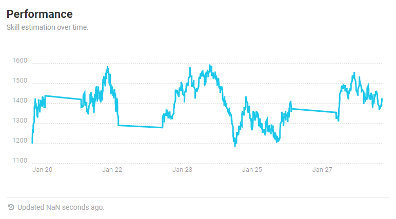
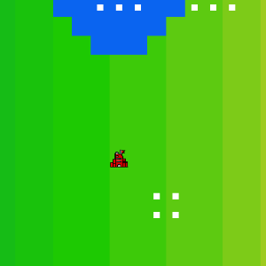
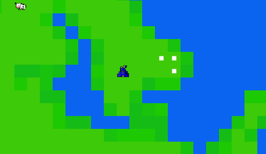

# MIT Battlecode 2020 Competition Post-Mortem
Iowa State University Artificial Intelligence Club members Austin Rognes and Augusto Savaris participated in the competition.

Team name: AI Club Iowa State

Austin Rognes
[Augusto Savaris :octocat:](https://github.com/augusto-menezes-savaris)

## Strategy

Our plan had a few steps:
    1. Mine nearby soup with 3 miners
    2. Build refinery and design school
    3. Build 20 landscapers
    4. Terraform land nearby HQ to raise it to a height based on time
    5. A designated miner builds every other building for luxury defense
    6. Once round 600 is reached, all landscapers surround HQ and begin building the wall
    7. On round 700, any drones will clump our HQ to shield any invasion attemps

## Analytics

Jan 23 our landscapers would only build a 3 by 3 wall, also known as a turtle. It was the standard strategy that everyone used because it worked. We left this strategy in favor of raising the land around the HQ and then building the turtle later on. We could then build a multi-layered turtle to beat other turtles, however we did not have enough time to implement this before 6pm, Jan 27.

## Best Case Scenario

*Notice the beautifully flat and even terrain
Our 3 by 3 turtle forms once the HQ-pad is complete, then drones clump together, stopping any enemies from getting in as long as they block all entrances.

## Every Other Case Scenario

The landscapers would try to raise the land too high instead of just trying to get everything above water level, which took too long. The problem was that in best case scenarios, the landscapers would have nothing to do.
